# GCP Real-Time Usage Analytics Pipeline

I built this to understand how companies like Rakuten, Uber, and Netflix make real-time decisions from user behavior data. Not the ML part — the plumbing underneath it. The part that answers "which feature is getting hammered right now?" and "is our checkout API about to fall over?"

The pipeline captures two kinds of events: what users are doing in the UI (clicks, page views, searches) and how the backend is responding (latency, status codes, errors). Everything flows through Pub/Sub into BigQuery, where you can actually ask interesting questions about it.

---

## Live Demo

| Link | Description |
|---|---|
| [Live Dashboard](https://usage-analytics-api-518291172957.us-central1.run.app/dashboard) | Real-time pipeline dashboard — auto-refreshes every 10s |
| [API Docs](https://usage-analytics-api-518291172957.us-central1.run.app/docs) | Interactive Swagger UI for all 5 endpoints |
| [Health Check](https://usage-analytics-api-518291172957.us-central1.run.app/health) | Pipeline status and total events ingested |
| [Error Rates](https://usage-analytics-api-518291172957.us-central1.run.app/events/errors) | Live API error rate monitoring with auto-alerting |

> Run `python seed.py 500` and watch the dashboard update in real time.

---

## Architecture
- **Publisher**: Simulates UI interactions (clicks, page views) and API request/response events every 500ms
- **Pub/Sub**: Decoupled message transport — `usage-events` topic. If the consumer goes down, messages queue and replay automatically. Dead letter queue catches any events that fail after 5 attempts.
- **Cloud Function**: Serverless Python consumer triggered automatically on each Pub/Sub message. Validates, transforms, and writes to BigQuery in under 2 seconds end-to-end.
- **BigQuery**: Analytical warehouse — `usage_events` table partitioned by DATE(timestamp) and clustered by component + event_type for cost-optimized queries at scale.
- **FastAPI on Cloud Run**: REST API layer exposing BigQuery data as live endpoints. Auto-alerts when any endpoint crosses 30% error rate.
- **Live Dashboard**: Single-page app served from Cloud Run. Pipeline flow animation, real-time charts, error rate monitoring, live event feed. Auto-refreshes every 10 seconds.



---

## The schema

This was the most important design decision. I wanted one table that could handle both UI interactions and API metrics without ugly joins.

| Field | Type | Notes |
|---|---|---|
| event_id | STRING | UUID, primary key |
| event_type | STRING | `ui_interaction` or `api_request` |
| component | STRING | Which part of the product — checkout, search, etc. |
| user_id | STRING | Anonymized — consistent across sessions |
| session_id | STRING | Groups events from a single browsing session |
| timestamp | TIMESTAMP | UTC, set at publish time. Table partitioned on this field. |
| latency_ms | INTEGER | Null for UI events, populated for API events |
| status_code | INTEGER | HTTP status — 200, 400, 404, 500, etc. |
| endpoint | STRING | `/api/checkout`, `/api/search`, etc. |
| metadata | STRING | JSON blob — action type for UI, HTTP method for API |

---

## API Endpoints

| Endpoint | Description |
|---|---|
| `GET /health` | Pipeline status, total events, last event timestamp |
| `GET /events/volume?hours=24` | Event count by component and type |
| `GET /events/errors?hours=24` | Error rate per endpoint with auto-alert flag |
| `GET /events/latest?limit=20` | Most recent N events |
| `GET /events/users?hours=24` | Unique users and engagement per component |

---

## What the queries tell you

**Event volume** — which components are getting the most traffic right now. If `checkout` suddenly spikes, either there's a sale happening or something is in a retry loop hammering the endpoint.

**API latency (p50/p95/p99)** — average latency is almost useless. p95 and p99 tell you what your worst-case users are experiencing. If p99 on `/api/checkout` creeps from 400ms to 2000ms, you're about to have a bad day. That's your signal to scale before users start complaining.

**Error rate breakdown** — 4xx vs 5xx matters. A spike in 4xx means clients are sending bad requests (maybe a frontend bug after a deploy). A spike in 5xx means your backend is failing — that's the one that pages the on-call engineer at 3am.

**User activity by component** — unique users and events per user per component. Low unique users + high events per user on a component usually means a small group of power users. High unique users + low events per user means people visit once and leave — that's a UX problem worth investigating.

---

## Running it yourself

You'll need a GCP project with these APIs enabled: Pub/Sub, Cloud Functions, BigQuery, Cloud Build, Cloud Run, Eventarc.

```bash
git clone https://github.com/SanketJanger/usage-analytics-pipeline.git
cd usage-analytics-pipeline

# Create Pub/Sub resources
gcloud pubsub topics create usage-events
gcloud pubsub subscriptions create usage-events-sub --topic=usage-events

# Create BigQuery dataset and table with partitioning
bq mk --dataset YOUR_PROJECT_ID:usage_analytics
bq mk --table YOUR_PROJECT_ID:usage_analytics.usage_events bigquery/schema.json

# Deploy the Cloud Function
gcloud functions deploy usage-event-processor \
  --gen2 --runtime=python311 --region=us-central1 \
  --source=./cloud_function --entry-point=process_event \
  --trigger-topic=usage-events

# Deploy the FastAPI layer
cd api
gcloud run deploy usage-analytics-api \
  --source . --region us-central1 \
  --platform managed --allow-unauthenticated

# Seed the pipeline with test events
cd ..
python seed.py 500
```

---

## What I learned building this

Pub/Sub's decoupling is genuinely useful — I could shut down the Cloud Function completely, keep publishing events, and when the function came back up it would process the backlog from where it left off. That reliability property doesn't exist if you're calling an API directly.

Cloud Functions cold start is real. First invocation after idle takes ~2 seconds. For a latency-sensitive pipeline you'd want minimum instances set to 1.

IAM on GCP is more granular than I expected. The service account needs separate roles for Pub/Sub publishing, subscribing, BigQuery writing, Cloud Run invoking, and Eventarc event receiving. Getting this wrong silently drops events with no obvious error — that took some debugging.

BigQuery's partitioning by DATE(timestamp) and clustering by component + event_type means queries only scan the relevant slice of data. At 10 million events, that's the difference between a $0.05 query and a $5 query.

The dead letter queue was the reliability piece I hadn't thought about initially. Without it, a malformed event that crashes the Cloud Function gets retried indefinitely and blocks the queue. With it, bad events are forwarded to a separate topic after 5 failed attempts and stored for investigation without blocking anything.

---

## Results

- **2,079+ events** ingested across 3 publisher sessions
- **Under 2 seconds** end-to-end latency (publish to BigQuery queryable)
- **6 components** tracked — checkout, search, product-listing, recommendations, ad-banner, user-profile
- **5 API endpoints** monitored with live error rate tracking
- **Auto-alerting** when error rate exceeds 30% threshold
- **Public live dashboard** — anyone can see real data at the link above

---

## Stack
`Python` · `Google Cloud Pub/Sub` · `Cloud Functions Gen2` · `BigQuery` · `FastAPI` · `Cloud Run` · `Looker Studio` · `Eventarc` · `GCP IAM` · `Docker` · `Cloud Monitoring`
